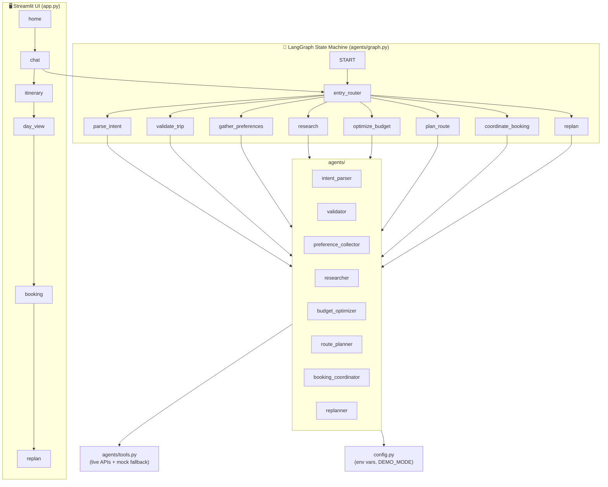

# WanderAI — Architecture Overview

This document describes the high-level architecture of **WanderAI** (agentic-travel-main): an AI-powered travel planning and booking agent built with **LangGraph**, **Streamlit**, and multiple external APIs. It also explains **why** the graph is structured the way it is: why these nodes exist, why they are ordered as they are, and why the flow pauses at specific points.

---

## 1. Design Philosophy and Rationale

### 1.1 Why a state machine (LangGraph)?

Travel planning is **multi-step and stateful**: the user says something → we parse it, validate it, maybe ask for more info, then only when we have a confirmed trip do we call expensive external APIs (flights, hotels, weather). A linear script would either call APIs too early (waste and wrong dates) or get tangled in nested conditionals. A **state machine** makes the flow explicit:

- **One clear “stage”** at any time (e.g. `validating_trip`, `presenting_options`). The next action is determined by that stage and the user’s next message.
- **Checkpointing** (LangGraph’s `MemorySaver`) lets the conversation be resumed correctly after each user reply without re-running from scratch.
- **Human-in-the-loop** is natural: we stop at defined points, show the user a message, and the next `invoke` continues from the same logical step.

So the graph is not “one big pipeline”; it is a **re-entrant workflow** that advances only when the user has confirmed or supplied the right information at each gate.

### 1.2 Why these nodes (and not fewer or more)?

Each node has a **single responsibility** and a clear input/output contract:

| Goal | Design choice |
|------|----------------|
| **Avoid calling APIs with incomplete data** | We never run **research** until the user has **confirmed** their trip (origin, destination, dates, trip type) and answered three **preference** questions (who’s travelling, hotel vibe, rental). So we need **validation**, **confirmation**, and **gather_preferences** before research. |
| **Let the user see real options before we lock choices** | We do not auto-pick transport/hotel and build an itinerary in one shot. We **present all options** (flights, trains, hotels, etc.) and **pause** so the user can say “cheapest”, “flight 2”, or “optimize”. Hence a dedicated **research** node that stops at `presenting_options`, and a separate **optimize_budget** node that interprets the user’s preference and selects options. |
| **Separate “what the user wants” from “what is valid”** | **parse_intent** only extracts a structured profile from natural language (it can be incomplete or ambiguous). **validate_trip** checks that profile against a Pydantic schema and asks for missing fields (e.g. dates, one-way vs return). Splitting these keeps intent extraction independent of validation rules and allows the validator to ask targeted questions. |
| **Budget and itinerary as distinct steps** | Picking transport + hotel and computing a budget breakdown is different from building a **day-by-day schedule**. **optimize_budget** selects options and fills `budget_breakdown` and `selected_transport` / `selected_hotel`. **plan_route** consumes those plus activities/weather and produces the `itinerary`. Doing both in one node would mix “what to book” with “how to schedule the days”. |
| **Booking as a finalization step** | **coordinate_booking** turns the finalized itinerary and selected options into booking summaries (references, status). It runs only after the user has approved the itinerary (or we’ve auto-continued). Keeping it as its own node makes the “trip locked in” moment explicit and allows future extension (e.g. real payment hooks). |
| **Re-planning as a separate path** | Delays or changes after the trip is “completed” are handled by **replan**, which adjusts the itinerary and returns the user to `reviewing_itinerary`. This is a different entry point (triggered by keywords when `stage == completed`) so the main flow stays simple and we don’t overload the same nodes with “first plan” and “change plan” logic. |

So: **parse_intent**, **validate_trip**, **gather_preferences**, **research**, **optimize_budget**, **plan_route**, **coordinate_booking**, and **replan** each exist because they map to a distinct phase of the user journey and a distinct kind of decision or data.

### 1.3 Why this order?

The order is **intentional** and follows dependency and cost:

1. **Parse intent first** — We must understand what the user wants (destination, origin, dates, budget, etc.) before we can validate or do anything else. So the first node after entry is always **parse_intent** when we’re in an early stage (idle, parsing_intent, validating_trip).
2. **Validate immediately after parse** — Validation uses the **same** profile that was just parsed (or merged with a previous profile when the user is answering validation questions). So the edge is always `parse_intent → validate_trip`. We never run research or any API without going through validation.
3. **Gather preferences after confirmation** — After the user confirms the trip (“Does this look right?” → “yes”), we run **gather_preferences** to ask three short questions (companion type, hotel vibe, rental). These answers are stored in `travel_profile` and improve research and recommendations. The router sends to **gather_preferences** when `stage == confirming_intent` or `gathering_preferences`; when all three are collected, `stage` becomes `preferences_collected` and we run **research**.
4. **Research only after preferences** — Research calls external APIs (flights, trains, hotels, activities, weather, rentals, web search). We only run it when `stage == preferences_collected`. That way we don’t waste API calls and we can tailor results (e.g. rentals for hill stations vs beach).
5. **Present options, then optimize** — Research produces a large set of options and sets `stage = presenting_options`, then the graph **stops**. On the next turn, the user’s message (e.g. “optimize”, “cheapest”, “flight 2”) is used by **optimize_budget** to pick transport and hotel. So the order is: research → (user reviews) → optimize_budget. We don’t optimize before showing options, so the user sees what’s actually available.
6. **Budget step allows in-step changes** — When `stage == confirming_budget`, the router always sends to **optimize_budget** so the user can say “change transport” or “change hotel” and get an updated selection without advancing. When they approve (“looks good”), the conditional edge can send to **plan_route** in the same turn or after the next invoke.
7. **Plan route after budget** — The itinerary depends on **selected** transport and hotel. **plan_route** runs when the user has approved the budget (or we’ve auto-continued). When `stage == reviewing_itinerary`, the router can send to **plan_route** (default), **coordinate_booking** (if user says “book”/“finalize”), **optimize_budget** (if “change transport/hotel”), or **replan** (if disruption keywords).
8. **Booking last** — **coordinate_booking** runs when the user says “book”/“finalize”/“looks good” while reviewing the itinerary. After that we set `stage = completed`.

Re-planning breaks this order: when the user says “my flight is delayed” and `stage == completed`, the UI sets `stage = replanning` and the next invoke goes directly to **replan**, which then sets `stage = reviewing_itinerary` so the user can review the revised itinerary.

### 1.4 Why pause at specific points (human-in-the-loop)?

The graph **always stops** after these nodes so the user can read the reply and respond:

- **After validate_trip** — We either ask for missing details or ask “Does this look right?”. We never auto-continue to research without the user saying “yes” or equivalent. So `validate_trip → END`. Rationale: avoid running expensive research on unconfirmed or incomplete trips.
- **After research** — We show all options (flights, trains, hotels, activities, weather) and ask the user to choose or say “optimize”. So `research → END`. Rationale: the user must be able to pick or reject options before we lock transport/hotel and build the itinerary.
- **After optimize_budget** — We show the selected transport, hotel, and budget breakdown and ask “looks good” or “change transport/hotel”. So we set `needs_human_input = True` and the conditional edge goes to `END`. Rationale: the user can correct the selection before we generate the day-by-day plan.
- **After plan_route** — We show the itinerary and optionally pause for “looks good” before booking. Again controlled by `needs_human_input`. Rationale: the user can request changes to the schedule before we finalize bookings.
- **After coordinate_booking** and **replan** — We show the booking summary or revised itinerary and stop. Rationale: final confirmation and optional re-planning.

So the “why” of each pause is: **don’t commit to the next expensive or irreversible step until the user has explicitly confirmed (or we’ve chosen to auto-continue via `needs_human_input = False`).**

### 1.5 Why an entry router (instead of a linear chain)?

In a purely linear graph you’d have: START → parse_intent → validate_trip → research → … and you’d need extra logic to “jump back” when the user sends a new message (e.g. from validating_trip we need to run parse_intent again to merge their reply, then validate again). With an **entry router**:

- **Every** user message starts at `START → entry_router(state)`.
- The router looks at **current `stage`** (and only that) and sends to the **one node** that should run next for that stage. For example:
  - `validating_trip` or `confirming_intent` → we need to re-parse the user’s reply and/or re-validate, so we route to **parse_intent** (for validating_trip) or directly to **research** (for confirming_intent, meaning user already said “yes”).
  - `presenting_options` → user just reviewed options; route to **optimize_budget**.
  - `confirming_budget` → user approved budget; route to **plan_route**.
  - etc.

So the **same graph** supports multi-turn conversations: each turn, we restore state from the checkpoint (and UI session state), add the new user message, invoke once, and the router sends us to the correct node. We don’t encode “if user said X then run Y” in the edges; we encode it in **stage** and let the router decide. That keeps the graph small and makes it easy to add new stages or branches (e.g. replan) without rewriting the whole flow.

---

## 2. High-Level Components

- **Entry point:** `app.py` — Streamlit app; first Streamlit command is `st.set_page_config`, then custom CSS and session state init. `main()` routes by `st.session_state.current_page` to `ui/home`, `ui/chat`, `ui/itinerary`, etc.
- **Orchestration:** `agents/graph.py` — builds a `StateGraph(TravelState)` with conditional edges and a single **entry router** that maps `stage` to the next node. The graph is compiled with `MemorySaver()` for checkpointing; `get_graph()` returns a singleton compiled graph.
- **State:** `agents/__init__.py` — defines `TravelState` (extends LangGraph `MessagesState`) and related TypedDicts: `TravelProfile`, `ResearchResult`, `DayPlan`, `BudgetBreakdown`, `BookingItem`, etc. `agents/state.py` re-exports them. All agents read/write this state.
- **Tools:** `agents/tools.py` — all external API calls and composite helpers (e.g. `research_destination`, `search_transport_options`, `search_hotels`, `get_weather`, `web_search_destination`). Uses `config` for API keys; falls back to `data/mock_data.py` when keys are missing or calls fail.
- **Config:** `config.py` — loads `.env` via `dotenv`; exposes `Config` with LLM and external API keys and `Config.is_demo()` / `Config.has_llm_key()`.

---

## 3. Application Entry and UI Flow

| File / Layer | Role |
|--------------|------|
| **app.py** | Sets page config, loads `ui.styles.CUSTOM_CSS`, initializes session state keys (`current_page`, `chat_history`, `travel_profile`, `research_results`, `budget_breakdown`, `itinerary`, `bookings`, `reasoning_log`, `agent_stage`, etc.), and routes to the correct page component. |
| **ui/home.py** | Landing; user can enter a prompt or go to chat. |
| **ui/chat.py** | Main conversation screen. Gets LangGraph via `agents.graph.get_graph()`, builds `initial_state` from session state + current user message, invokes `graph.invoke(initial_state, config)` with a stable `thread_id`, then writes back to session state (`travel_profile`, `research_results`, `itinerary`, `agent_stage`, etc.) and renders messages. |
| **ui/itinerary.py** | Renders the day-by-day itinerary (from `st.session_state.itinerary`). |
| **ui/day_view.py** | Day detail view. |
| **ui/booking.py** | Booking summary. |
| **ui/replan.py** | Re-planning flow (e.g. after delays/changes). |

Session state is the single source of truth for the UI; the graph output is merged into it after each `invoke`.

---

## 4. LangGraph State Machine

### 4.1 State Schema (`TravelState`)

Defined in `agents/__init__.py` (re-exported from `agents/state.py`):

- **travel_profile** — `TravelProfile`: destination, origin, dates, date_from, date_to, trip_type, duration_days, budget, currency, travel_style, interests, group_size, constraints, parsed; plus **companion_type** (solo | couple | friends | family), **hotel_preference** (budget | mid-range | luxury | boutique), **stay_type**, **rental_preference** (bike | scooter | car | none) — collected by the Preference Collector after intent confirmation.
- **stage** — Literal: `idle` | `parsing_intent` | `validating_trip` | `confirming_intent` | `gathering_preferences` | `preferences_collected` | `researching` | `presenting_options` | `optimizing_budget` | `confirming_budget` | `planning_route` | `reviewing_itinerary` | `booking` | `confirming_booking` | `replanning` | `completed`.
- **research_results** — `ResearchResult`: flights, trains, buses, driving, transport_recommendation, hotels, activities, weather, local_tips, web_knowledge; plus **rentals** (bike/scooter/car options), **destination_type** (hill_station | beach | city | heritage | spiritual).
- **budget_breakdown** — `BudgetBreakdown`: accommodation, transport, food, activities, miscellaneous, total, per_person, remaining.
- **itinerary** — list of `DayPlan` (day_number, date, theme, activities, estimated_cost, weather).
- **bookings** — list of `BookingItem` (type, name, status, reference, details, image_url).
- **reasoning_log** — list of strings (agent reasoning steps).
- **messages** — LangGraph message list (HumanMessage / AIMessage).
- **needs_human_input** — boolean; when true, graph stops and waits for user reply.
- **current_checkpoint** — string (e.g. ask_companion, ask_hotel, ask_rental, done) used by Preference Collector.
- **selected_transport** / **selected_hotel** — user/optimizer-selected options.

**Why this schema?** The state holds everything the UI needs to render (profile, options, itinerary, bookings) and everything the graph needs to decide the next step (stage, needs_human_input, messages). Keeping `research_results` separate from `selected_transport`/`selected_hotel` lets us show “all options” first and then “what we picked”. Preference fields in `travel_profile` drive research and optimizer behavior without running research until all three questions are answered.

### 4.2 Why these stages?

Each stage value corresponds to a **single place** in the user journey and tells the entry router **which node to run next** when the user sends a message:

- **idle / parsing_intent / validating_trip** → run **parse_intent** (then the fixed edge runs validate_trip). We (re-)parse so that when the user is answering a validation question (e.g. “March 15 to March 20”), their reply is merged into the existing profile. parse_intent always sets `stage = validating_trip`; only **validate_trip** sets `confirming_intent` when the profile is valid.
- **confirming_intent** → run **gather_preferences**. The user has confirmed the trip (“yes” to “Does this look right?”). Before calling APIs, we ask three short questions (who’s travelling, hotel vibe, rental) one by one.
- **gathering_preferences** → run **gather_preferences** again until all three answers are saved; then it sets `stage = preferences_collected` and `needs_human_input = False` so the conditional edge can chain to research in the same turn, or we stop for the next question.
- **preferences_collected** → run **research**. All preference answers are in the profile; we now call external APIs (flights, trains, hotels, activities, weather, rentals, etc.).
- **presenting_options** → run **optimize_budget**. The user has seen options and their message (“optimize”, “cheapest”, “flight 2”) is used to pick transport and hotel.
- **confirming_budget** → run **optimize_budget** again (loop). The router always returns `optimize_budget` for this stage so the user can say “change transport” or “change hotel” and get an updated selection without leaving the step; when they say “looks good” / “proceed”, the *next* turn will have a different stage (confirming_budget still, but the optimizer can set stage to planning_route when it detects approval — see graph: conditional edge after optimize_budget goes to plan_route when `needs_human_input` is False).
- **reviewing_itinerary** → **message-based routing**: if the user says “book”, “finalize”, “looks good”, “confirm” → **coordinate_booking**; if “change transport” or “change hotel” → **optimize_budget**; if replan keywords → **replan**; otherwise **plan_route** (e.g. to re-render or edit itinerary).
- **replanning** → run **replan**. Separate path for “my plans changed” after completion.

So stages are not just labels; they are the **routing key** that makes the re-entrant, message-driven flow work. The router also inspects the **latest user message** for `reviewing_itinerary` and `confirming_budget` to support in-step changes (e.g. “change hotel”) without changing stage.

### 4.3 Graph Structure (`agents/graph.py`)

- **Nodes:** `parse_intent`, `validate_trip`, `gather_preferences`, `research`, `optimize_budget`, `plan_route`, `coordinate_booking`, `replan`.
- **Entry:** `START` → `entry_router(state)`. The router uses **stage** and, for some stages, the **latest user message** (e.g. “change hotel”, “book”, “finalize”).
  - Default mapping: `idle`/`parsing_intent`/`validating_trip` → parse_intent; `confirming_intent` → gather_preferences; `gathering_preferences` → gather_preferences; `preferences_collected` → research; `presenting_options` → optimize_budget; `confirming_budget` → optimize_budget; `reviewing_itinerary` → plan_route (unless message overrides below); `replanning` → replan.
  - **Special cases:** When `stage == reviewing_itinerary`, if the user says “book”/“finalize”/“looks good”/“confirm” → coordinate_booking; “change transport”/“change hotel” → optimize_budget; replan keywords → replan; else plan_route. When `stage == confirming_budget`, the router always returns optimize_budget so the user can change transport/hotel in place.
- **Edges and why they are defined this way:**
  - **parse_intent → validate_trip** (fixed): Every time we parse, we run validation in the same turn.
  - **validate_trip → END** (fixed): We always stop after validation. Next invoke: router sends to parse_intent (if still validating_trip) or to gather_preferences (if confirming_intent).
  - **gather_preferences → END | research** (conditional on `needs_human_input`): If we still need an answer (Q1, Q2, or Q3), we stop; otherwise we chain straight to research in the same turn so we don’t require an extra “go” message after the last preference.
  - **research → END** (fixed): We always pause after showing options so the user can choose or say “optimize”.
  - **optimize_budget → plan_route | END** (conditional on `needs_human_input`): Stop for “looks good”/“change hotel” or auto-continue to plan_route when appropriate.
  - **plan_route → coordinate_booking | END** (conditional on `needs_human_input`): Optional pause to review the itinerary before booking.
  - **coordinate_booking → END**, **replan → END**: Terminal steps; we always stop after them.

**Summary:** Parse intent → Validate trip → (user confirms) → **Gather preferences** (3 questions, one by one) → Research → (user reviews options) → Optimize budget (with in-step “change transport/hotel” loop) → Plan route → (user can “book”/“finalize” or change/replan) → Coordinate booking → Done. Re-planning is triggered when the user sends a message indicating delay/change and the stage is `completed`; the chat UI sets `stage` to `replanning` and the next invoke routes to `replan`.

---

## 5. Agents (Nodes) — Why Each Exists and Where It Sits

| Agent | File | Responsibility | Why this node and position |
|-------|------|----------------|----------------------------|
| **parse_intent** | `intent_parser.py` | Extracts structured travel preferences from the last user message (destination, origin, dates, budget, etc.) using LLM (OpenAI) or keyword fallback; writes `travel_profile` and sets `stage` to `validating_trip`. When the user is in `validating_trip`, merges the new message into the existing profile so that “March 15 to March 20” fills in dates. | **Why:** We need a single place that turns natural language into a structured profile. **Why here:** It runs at the start of the flow (idle/validating_trip) and immediately before validation so that validation always sees the latest merged profile. |
| **validate_trip** | `validator.py` | Validates `travel_profile` against Pydantic `TripRequest`; if missing fields, sets `stage` to `validating_trip` and asks for dates / one-way vs return; if valid, sets `stage` to `confirming_intent` and asks "Does this look right?". Normalizes `date_from`/`date_to` into the profile. | **Why:** APIs need concrete dates and trip type. **Why here:** It runs right after parse so we only proceed to gather_preferences when the profile is valid and the user has confirmed. |
| **gather_preferences** | `preference_collector.py` | Asks three short questions one at a time (who’s travelling → companion_type; hotel vibe → hotel_preference; rent a vehicle? → rental_preference). Saves answers into `travel_profile`, uses `current_checkpoint` (ask_companion, ask_hotel, ask_rental, done). When all three are collected, sets `stage` to `preferences_collected` and `needs_human_input` False so the graph can chain to research in the same turn. | **Why:** Preferences improve research and recommendations (e.g. rentals for hill stations) without overloading the first message. **Why here:** After user confirms intent; before research so APIs get a richer profile. |
| **research** | `researcher.py` | Calls `research_destination()` from tools (flights, trains, buses, hotels, activities, weather, rentals, web knowledge); builds one AIMessage presenting all options with tags (Cheapest, Best Value, etc.); sets `stage` to `presenting_options`, `needs_human_input` True. | **Why:** Research is expensive and must happen only once we have a confirmed trip and preferences. Presenting *all* options gives the user real choice. **Why here:** Router sends here when `stage == preferences_collected` (after gather_preferences is done). |
| **optimize_budget** | `budget_optimizer.py` | Reads the user’s latest message (“optimize”, “cheapest”, “flight 2”, “hotel 1”, “change transport”, “change hotel”) and picks transport and hotel from research results; computes budget breakdown; sets `selected_transport`, `selected_hotel`, `budget_breakdown`, `stage` to `confirming_budget`, `needs_human_input` True. When `stage` is already `confirming_budget`, the router always sends here so the user can change transport/hotel in place. | **Why:** The user must be able to lock in choices or correct them before we build the itinerary. **Why here:** Runs when `stage == presenting_options` (first time) or `confirming_budget` (in-step changes); output consumed by plan_route. |
| **plan_route** | `route_planner.py` | Builds day-by-day itinerary (LLM or rule-based) from profile, activities, weather, budget, and **selected_transport** / **selected_hotel**; writes `itinerary` and sets stage to `reviewing_itinerary`. | **Why:** The schedule depends on chosen transport and hotel. **Why here:** Router sends here when `stage == reviewing_itinerary` unless the user says “book”/“finalize” (→ coordinate_booking), “change transport/hotel” (→ optimize_budget), or replan keywords (→ replan). |
| **coordinate_booking** | `booking_coordinator.py` | Generates booking items (flight, hotel) with references and details from research and selected options; sets `bookings` and `stage` to `completed`. | **Why:** Finalization is a distinct step (and a future hook for real booking APIs). **Why here:** Router sends here when `stage == reviewing_itinerary` and the user says “book”, “finalize”, “looks good”, or “confirm”. |
| **replan** | `replanner.py` | Reads the user’s disruption message, revises the itinerary (e.g. shift activities, move one to next day), sets `itinerary` and `stage` to `reviewing_itinerary`, `needs_human_input` True. | **Why:** Post-completion changes (delay, cancel) need different logic than the first plan. **Why here:** Router sends here when `stage == replanning` (set by the UI when the user says “delay”/“change” and stage was completed). |

---

## 6. Data Flow Summary

1. User types in **chat** → `chat.py` appends message, calls `graph.invoke(initial_state, config)` with current `agent_stage` and any preserved state (travel_profile, research_results, itinerary, etc.).
2. **entry_router** chooses node from `stage` (and for `reviewing_itinerary` / `confirming_budget`, from the latest user message).
3. **parse_intent** updates `travel_profile`, sets `stage` to `validating_trip`; graph goes to **validate_trip** then `END`.
4. User replies with dates or confirmation → next invoke: if `stage` is `validating_trip`, router sends to **parse_intent** (merges reply), then **validate_trip**; if valid, validate_trip sets `stage` to `confirming_intent` and asks “Does this look right?”. If the user says “yes”, next invoke `stage` is `confirming_intent` and the router sends to **gather_preferences** (not research).
5. **gather_preferences** asks one of three questions (companion, hotel vibe, rental), saves the answer into `travel_profile`, and either stops (next question) or sets `stage` to `preferences_collected` and `needs_human_input` False so the conditional edge chains to **research** in the same turn.
6. **research** calls `research_destination()` (tools), gets flights/trains/buses/hotels/activities/weather/rentals; presents options and sets `stage` to `presenting_options`, then `END`.
7. User says "optimize" or "cheapest" → router sends to **optimize_budget**, which selects options and fills budget; typically `END`. User can then say “looks good” (next turn router sends to optimize_budget again, which may set `needs_human_input` False and chain to **plan_route**) or “change transport”/“change hotel” (router sends to **optimize_budget** again for in-step update).
8. **plan_route** produces `itinerary` and sets `stage` to `reviewing_itinerary`. User can say “book”/“finalize” → router sends to **coordinate_booking**; “change transport/hotel” → **optimize_budget**; replan keywords → **replan**; else **plan_route** (e.g. re-render).
9. **coordinate_booking** produces `bookings` and sets `stage` to `completed`.
10. All updates from each `invoke` are written back into Streamlit session state so the UI stays in sync.

---

## 7. Configuration and Demo Mode

- **config.py** reads `OPENAI_API_KEY`, `ANTHROPIC_API_KEY`, and all external API keys from the environment (see `.env.example`).
- **DEMO_MODE**: `auto` (default) = enable demo when no LLM key is set; `true` / `false` override.
- When API keys are missing, `agents/tools.py` uses mock data from `data/mock_data.py` (e.g. `MOCK_FLIGHTS`, `MOCK_HOTELS`, `MOCK_ACTIVITIES`, `MOCK_WEATHER`, `LOCAL_TIPS`) so the app can run without external services.

---

## 8. Key Files Reference

| Path | Purpose |
|------|--------|
| `app.py` | Streamlit entry; page routing; session state init. |
| `config.py` | Env-based config; API keys; demo mode. |
| `agents/__init__.py` | TravelState and related TypedDicts (TravelProfile, ResearchResult, DayPlan, etc.). |
| `agents/state.py` | Re-exports TravelState and types from `agents/__init__.py`. |
| `agents/graph.py` | LangGraph build, entry_router, edges, get_graph(). |
| `agents/intent_parser.py` | parse_intent node. |
| `agents/validator.py` | validate_trip node. |
| `agents/preference_collector.py` | gather_preferences node; 3 questions (companion, hotel, rental). |
| `agents/researcher.py` | research node; calls tools.research_destination. |
| `agents/budget_optimizer.py` | optimize_budget node. |
| `agents/route_planner.py` | plan_route node. |
| `agents/booking_coordinator.py` | coordinate_booking node. |
| `agents/replanner.py` | replan node. |
| `agents/tools.py` | All external API calls and composite research. |
| `agents/schemas.py` | Pydantic TripRequest; profile_to_trip_request; trip_request_missing_fields. |
| `data/mock_data.py` | Mock data for demo/fallback. |
| `ui/chat.py` | Chat screen; graph.invoke; session state sync. |
| `ui/home.py`, `ui/itinerary.py`, `ui/booking.py`, `ui/replan.py`, `ui/day_view.py` | Other pages. |
| `ui/components.py`, `ui/styles.py` | Shared UI components and CSS. |

For **how each external API is called**, request/response shapes, and env vars, see **[External APIs](external-apis.md)**.
